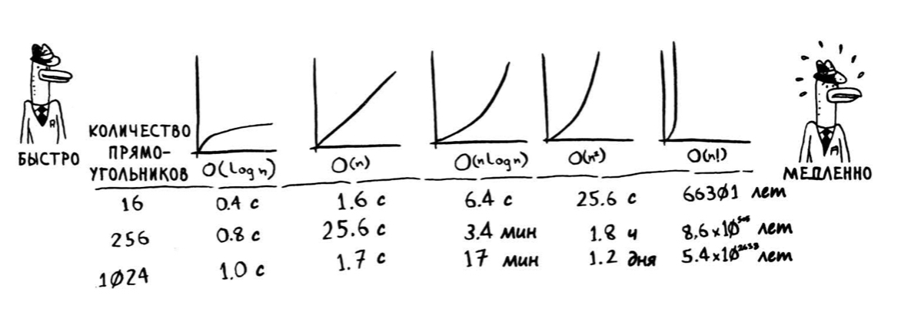

# Алгоритмы

**O-большое** — описывает с какой скоростью будет работать алгоритм при разном кол-ве операций. Есть несколько основных примеров:
- **O(log n)**, или логарифмическое время. Пример: бинарный поиск.
- **О(n)**, или линейное время. Пример: простой поиск.
- **О(n ** log n)**. Пример: быстрая сортировка
- **О(n^2)**. Пример: сортировка выбо­ром
- **О(n!)**. Пример: очень медленные алгоритмы (задача о коммивояжере)

## Основные тезисы
- Скорость алгоритмов измеряется не в секундах, а в темпе роста количе­ ства операций.
- По сути формула описывает, насколько быстро возрастает время выпол­ нения алгоритма с увеличением размера входных данных.
- Время выполнения алгоритмов выражается как «О-большое».
- Бремя выполнения O(log n) быстрее О(n), а с увеличением размера спи­ска, в котором ищется значение, оно становится намного быстрее.

## Список алгоритмов
- **Бинарный поиск**. {**O(log n)**} — поиск значения в отсортированном массиве делением массива пополам.
- **Сортировка выбором**. {**O(n^2)**} — занимает так много времени, потому что нам нужно каждый раз пробегаться по всему списку и выдергивать нужный нам элемент (например группу с самым большим кол-вом прослушиваний)
- **Сортировка слиянием**. {**О(n log n)**} - разбиваем массив пополам на k элементе. Сортируем каждую отдельную часть разбив её тоже на 2 части. И так разбиваем всё пополам пока не закончатся элементы
- **Быстрая сортировка**. {худший случай — **O(n^2)**, средний случай — **О(n log n)**} — время зависит от выбранного элемента. Тут мы выбираем опорный элемент и распределяем все элементы больше опорного и меньше опорного элемента. Потом мы берем другие части и также их разбиваем с опорным элементом и сортируем. НО Худший случай мы можем получить если будем брать не удачный элемент для дроби или массив уже будет отсортирован
- **Поиск в ширину**. — высчитывает кратчайшую длинну в невзвешенном графе из точки A в точку B
- **Алгоритм Дейкстры**. — поиск самого быстрого пути во взвешенном графе из точки A в точку B. Главное чтобы все ребра были с положительным весом и граф был однонаправленный. Находим узел с наименьшей стоимостью. Проверяем его соседей и можем ли добраться до них более быстрым путем, если да, то обновляем ихстоимость. Повторяем это для всех узлов. _При наличии отрицательных весов используйте алгоритм Беллмана­ Форда._
- **Динамическое программирование** — например когда мы хотим определить какие вещи взять, чтобы общая их цена была максимальной. Динамическое программирование работает только в ситуациях, в кото­ рых задача может быть разбита на автономные подзадачи, не зависящие друг от друга.
- **k ближайших соседей** — например построение рекомендаций на основе ваших ближайших соседей.
- **Алгоритмы SHA**
- **Обмен ключами Диффи-Хеллмана**
- **Жадные алгоритмы** — Это когда мы выбираем от дороговизны/большенства покрытия и тд. То есть мы стараемся сначала взять самое весомое и так пока не заполнится необходимый уровень

## Определить NP-полную задачу
- ваш алгоритм быстро работает при малом количестве элементов, но сильно замедляется при увеличении их числа;
- формулировка ~все комбинации х~ часто указывает на NР-полноту за­ дачи;
- вам приходится вычислять все возможные варианты Х, потому что за­ дачу невозможно разбить на меньшие подзадачи? Такая задача может оказаться NР-полной;
- если в задаче встречается некоторая последовательность (например, последовательность городов, как в задаче о коммивояжере) и задача не имеет простого решения, она может оказаться NР-полной;
- если в задаче встречается некоторое множество (например, множество радиостанций) и задача не имеет простого решения, она может оказаться NР-полной;
-  У NР-полных задач не существует известных быстрых решений.

## Память
- В массиве все элементы хранятся в памяти рядом друг с другом.
- В списке элементы распределяются в произвольных местах памяти, при этом в одном элементе хранится адрес следующего элемента.
- Массивы обеспечивают быстрое чтение.
- Списки обеспечивают быструю вставку и выполнение.

## Полезные ссылки
- [Курсы по алгоритмам](https://youtu.be/KdZ4HF1SrFs)
- [Вики по алгоритмам](https://algowiki-project.org/)