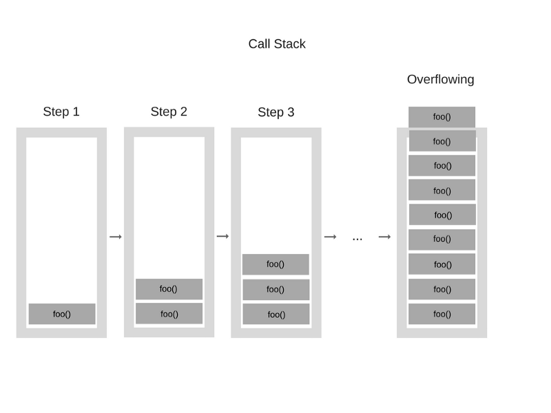

# Интерпритаторы и компиляторы

Для того, что бы машина выполнила ваш код его нужно сначала преобразовать в машинный код. Для это и существуют компиляторы и интерпритаторы.

**Синтаксический анализ и лиексический анализ** — преобразование компилятором исходного кода в дерево с помощью словаря, которое потом используется для создания документа с машинным кодом.

**опкод** — двоичный код

**Байт-код** — промежуточное представление написанного кода. То есть компактное представление программы, которая была написана человеком. Перевод в байт-код проходит этапы синтаксического и семантического анализа.
Байт-код нужен для выполнения на виртуальной машине. + его удобство в том, что его удобно портировать на разные системы.

**Машинный код** — набор команд, которые выполняет процессор.

**Интерпритатор** — программа, которая выолняет построчный анализ и выполнение исходного кода. При данном подходе ошибки в программе обнаружатся только при её выполнении.

**Компилятор** — программа, которая анализирует ваш код и преобразует в байт-код с дополнительниыми оптимизациями. При данном подходе компилятор во время анализа кода укажет, где программа будет выполняться неверно и прекратит свою работу.

**Динамическая компиляция / JIT-компиляция(Just in Time compilation)** — Это совмещение двух подходов. Сначала компилятор преобразует программу в байт-код без дополнительных оптимизаций, что ускоряет время до начала его выполнения, а потом JIT компилирует байт-код в машинный код. Увеличение скорости происходит за счет того, что куски кода, которые были преобразованы в машинный код могут кэшироваться и могут потом использоваться без перекомпиляции. В браузерах для этого был добавлен профилировщик, который анализирует код и может сообщить об ошибках на начальном этапе.

**Виртуальная машина** — своего рода виртуальный процессор, который берет байт код и может его прочитать на любой системе. Например: Мы скомпилировали проект на Java. И что бы его прочитать нам необходим JVM, который можно установить на любую систему и он сможет прочитать наш скомпилированный код. Отсюда получается, что мы никак не завязываемся на архитектуру системы при компиляции и наш код будет кроссплатформенным.

**Сборка мусора** — Одна из форм автоматического управления памятью. переодически сборщик мусора очищаешь объекты, которые уже не нужны, что бы очистить их из памяти.

## JavaScript-движок

Сценарный язык [JavaScript](https://ru.wikipedia.org/wiki/JavaScript) выполняется различными высокопроизводительными [«движками»](https://ru.wikipedia.org/wiki/Движок_JavaScript), в основном, встроенными в веб-браузеры, часто с возможностью JIT-оптимизации. Многие интерпретаторы построены с применением байт-кода, однако программы на Javascript распространяются в виде исходных кодов. Он сначала компилируется, а затем интерпретируется движком.

**JavaScript-движки** являются однопоточными, то есть для исполнения функций применяется единственный стек вызовов. Это ограничение лежит в основе асинхронной природы JavaScript: все операции, для выполнения которых требуется какое-то время, должны управляться внешней сущностью (например, браузером) или функцией обратного вызова.


**Абстрактные синтаксические деревья.** — изначальный код, который разобран и представлен в виде дерева.

<details>
<summary>Пример кода:</summary>

```js
function foo() {
	var bar = 10;
}
```
</details>

<details>
<summary>Как выглядит синтаксическое дерево:</summary>

```json
{
    "type": "Program",
    "body": [
        {
            "type": "FunctionDeclaration",
            "id": {
                "type": "Identifier",
                "name": "foo"
            },
            "params": [],
            "body": {
                "type": "BlockStatement",
                "body": [
                    {
                        "type": "VariableDeclaration",
                        "declarations": [
                            {
                                "type": "VariableDeclarator",
                                "id": {
                                    "type": "Identifier",
                                    "name": "bar"
                                },
                                "init": {
                                    "type": "Literal",
                                    "value": 10,
                                    "raw": "10"
                                }
                            }
                        ],
                        "kind": "var"
                    }
                ]
            },
            "generator": false,
            "expression": false,
            "async": false
        }
    ],
    "sourceType": "script"
}
```
</details>


**Движок** — интерпритатор, который выполняет наш код. Он может быть написан с помощью разных приёмов: обычный интерпритатор, JIT-компилятор, который перед выполнением программы преобраузет исходный код в байт-код некоего формата.

Движок работает следующим образом: У нас есть `куча (Memory Heap)` и `стек вызовов (Call stack)`. В стек записывается место, где сейчас находится наш указатель и происходит выполнение функции, где в стек попадают команды для выполнения, а потом выполняются сверху вниз, потому что так работает стек.

<details>
<summary>Пример кода:</summary>

```js
function multiply(x, y) {
    return x * y;
}
function printSquare(x) {
    var s = multiply(x, x);
    console.log(s);
}
printSquare(5);
```

#### Схема стека, для код выше:

</details>

<details>
<summary>Пример кода с переполнением стека:</summary>

### Пример переполнения стека:
```js
function foo() {
    foo()
}

foo()
```

#### Схема переполнения стека:

</details>

## Таски и микротаски

*Event Loop* — бесконечный цикл, который берет в работу задачу из очереди и выполняет её. В конце либо происходит, либо нет, если оно того требуется и приступает к выполнению следующей таски. Все таски складываются в очередь по принципу LIFO, что гарантирует порядок выполнения очереди. Если ничего нет для выполнения, то он встает в бесконечный цикл, который следит, нужно ли выполнить что-то еще.

*Task* — задача, которую нужно выполнить, например вызов функции и последующее её выполнение.
В примере ниже мы складываем вызов `main()` в очередь. `Event Loop` берет задачу из очереди и выполняет её. Делает вызов `main()`. Потом  происходит вызов `console.log()`. Потом работа `main()` заканчивается и стек очищается.
```js
function main() {
    console.log('main');
}

main();
```

*Microtask* — Микротаски - это колбэки, которые передаются в `Promise.then()`. Они выполняются, когда очищается стек или когда закончилась выполнения таска. Если микротаск порождает новый микротаск, то он сразу будет выполнен, а не складываться в очередь.
```js
function first() {
    console.log(1)
}

function second() {
    Promise.resolve().then(() => console.log(2))
}

function third() {
    console.log(3)
}

function main() {
    first()
    second()
    third()
}

main() // 1, 3, 2
```

## Полезные ссылки
* [Устройство JavaScript-движков](http://jsflow.org/docs/js-engines/)
* http://esprima.org/demo/parse.html?code=function%20foo()%20%7B%0A%09var%20bar%20%3D%2010%3B%0A%7D
* [Как работают сжиматели JavaScript](https://learn.javascript.ru/minification)
* [Создание языка программирования с использованием LLVM. Часть 4: Добавление JIT и поддержки оптимизатора](https://habr.com/en/post/120516/)
* [JIT-компиляция](https://ru.wikipedia.org/wiki/JIT-компиляция)
* [Как работает JS: о внутреннем устройстве V8 и оптимизации кода](https://habr.com/ru/company/ruvds/blog/337460/)
* [Как работает JS: обзор движка, механизмов времени выполнения, стека вызовов](https://habr.com/en/company/ruvds/blog/337042/)
* [Как работает JS: абстрактные синтаксические деревья, парсинг и его оптимизация](https://habr.com/en/company/ruvds/blog/415269/)
* https://github.com/sq/JSIL/wiki/Optimizing-dynamic-JavaScript-with-inline-caches
* [Иван Тулуп: асинхронщина в JS под капотом](https://habr.com/ru/company/oleg-bunin/blog/417461/)
* [Простой пример работы](http://latentflip.com/loupe/?code=JC5vbignYnV0dG9uJywgJ2NsaWNrJywgZnVuY3Rpb24gb25DbGljaygpIHsKICAgIGNvbnNvbGUubG9nKCdjbGljaycpOyAgICAKfSk7CgpzZXRUaW1lb3V0KGZ1bmN0aW9uIHRpbWVvdXQoKSB7CiAgICBjb25zb2xlLmxvZygidGltZW91dCIpOwp9LCA1MDAwKTsKCmNvbnNvbGUubG9nKCJIZWxsbyB3b3JsZCIpOw%3D%3D!!!PGJ1dHRvbj5DbGljayBtZSE8L2J1dHRvbj4%3D)
* https://www.youtube.com/watch?v=cCOL7MC4Pl0&feature=youtu.be
* [Сборка мусора](https://ru.wikipedia.org/wiki/Сборка_мусора)
* [Принцип работы сборщика мусора](https://learn.javascript.ru/memory-management)
* [JavaScript event loop в картинках (часть 1)](https://medium.com/@pavelbely/javascript-event-loop-в-картинках-часть-1-a19e4d99f242)
* [JavaScript-движки: как они работают? От стека вызовов до промисов — (почти) всё, что вам нужно знать](https://habr.com/ru/company/mailru/blog/452906/)
* [Tasks, microtasks, queues and schedules](https://jakearchibald.com/2015/tasks-microtasks-queues-and-schedules/)